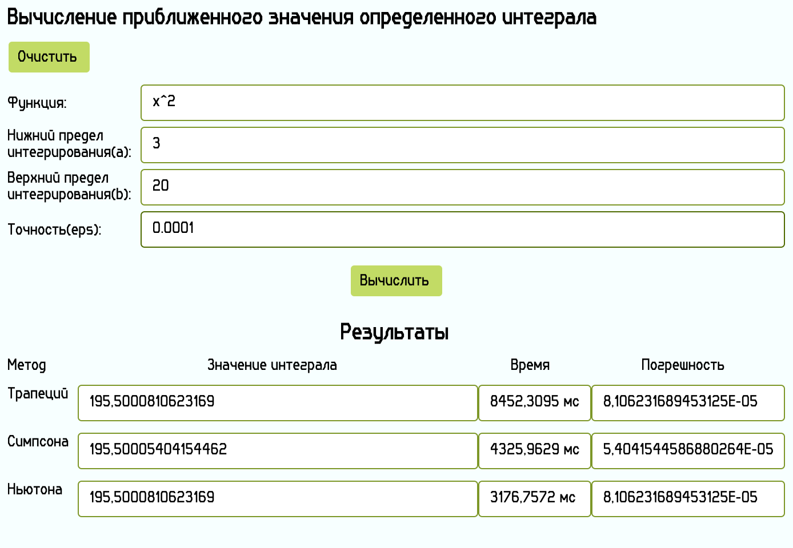

# ChMLab2 (Avalonia UI)
### Задание:
Вычисление приближённого значения определённого интеграла a b f ( x)dx на основе составных квадратурных формул трапеций, Симпсона и Ньютона с заданной точностью eps. Контроль точности выполнять с помощью принципа Рунге. Входная информация: функция f(x), границы a и b, точность eps. Выходная информация: значения интегралов, полученные по формулам трапеций, Симпсона и Ньютона, время работы алгоритмов, достигнутая точность.

### Мои комментарии к программе:
1. Входные данные: функция, нижний предел интегрирования, верхний предел интегрирования, точность eps.
Выходные данные: значения, время, погрешности вычисленные с помощью методов трапеций, Симпсона, Ньютона
2. Программа написана с использованием Avalonia и .NET 9.0. Т.к эти библиотеки занимает много места, папки bin здесь нет. При желании скомпилировать программу просто поместите эти файлы в ваш проект Avalonia. (Программа создавалась в vs code).
3. Программа использует библиотеку NCalc
4. Sin, Cos, Tan - с большой буквы (считает в радианах)
5. Константы: e, pi 

# Интерфейс:

# Пример использования:

